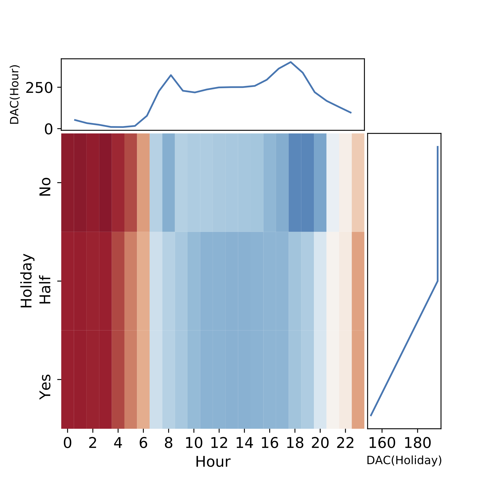
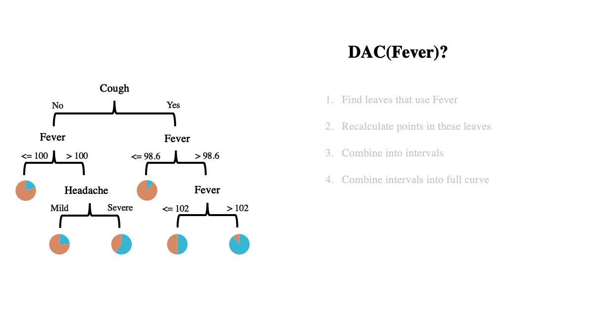

# disentangled attribution curves (DAC)
Official code for using / reproducing DAC from the paper "Disentangled Attribution Curves for Interpreting Random Forests" https://arxiv.org/abs/1905.07631v1

*Note: this code is actively developed and maintained. For any questions please file an issue.*


# documentation

## using DAC on new models
- the core of the method code lies in the [dac](dac) folder and is compatible with scikit-learn
- the [examples/xor_dac.ipynb](examples/simple_ex.py) folder contains examples of how to use DAC on a new dataset with some simple datasets (e.g. XOR, etc.)
- the basic api consists of two functions: `dac` and `dac_plot`
- ```dac.dac(forest, input_space_x, outcome_space_y, assignment, S, continuous_y=True, class_id=1)```
  
  - inputs:
  	
      - `forest`: an sklearn ensemble of decision trees
      - `input_space_x`: the matrix of training data (feature values), a numpy 2D array
      - `outcome_space_y`: the array of training data (labels/regression targets), a numpy 1D array
      - `assignment`: a matrix of feature values that will have their DAC importance score evaluated, a numpy 2D array
      - `S`: a binary indicator of whether to include each feature in the importance calculation, a numpy 1D array with values 0 and 1 only
      - `continuous_y`: a boolean indicator of whether the y targets are regression(true) or classification(false), defaults to true
      - `class_id`: if classification, the class value to return proportions for, defaults to 1
  - returns
  
    - `dac.dac_curve`
  
      - for regression: a numpy array whose length corresponds to the number of samples in the assignment input.  Each entry is a DAC importance score, a
        float between min(outcome_space_y) and max(outcome_space_y)
      - for classification: a numpy array whose length corresponds to the number of samples in the assignment input.  Each entry is a DAC importance score, a
        float between 0 and 1
- ```dac.dac_plot(forest, input_space_x, outcome_space_y, S, interval_x, interval_y, di_x, di_y, C, continuous_y, weights```
    - inputs
      - `forest`: an sklearn ensemble of decision trees (random forest or adaboosted forest)
      - `input_space_x`: the matrix of training data (feature values), a numpy 2D array
      - `outcome_space_y`: the array of training data (labels/regression targets), a numpy 1D array
      - `S`: a binary indicator of whether to include each feature in the importance calculation, a numpy 1D array with values 0 and 1 only
      - `interval_x`: an interval for the x axis of the plot, defaults to None.  If None, a reasonable interval will be extrapolated from the range
        of the first feature specified in S.
      - `interval_y`: an interval for the y axis of the plot (only applicable to heat maps), defaults to None.  
        If None, a reasonable interval will be extrapolated from the range of the second feature specified in S.
      - `di_x`: a step length for the x axis of the plot, defaults to None.  If None, a reasonable step length will be extrapolated from the range
        of the first feature specified in S.
      - `di_y`: a step length for the y axis of the plot (only applicable to heat maps), defaults to None.  If None, a reasonable step
        length will be extrapolated from the range of the second feature specified in S.
      - `C`: a hyper-parameter specifying the number of standard deviations samples can be from the mean of the leaf and be counted into the curve.  Smaller values
        yield a more sensitive curve, larger values yield a smoother curve.
      - `continuous_y`: a boolean indicator of whether the y targets are regression(true) or classification(false), defaults to true
      - `weights`: weights for the individual estimators contributions to the curve, defaults to None.  If None, weights will be extrapolated from the forest type.
    - returns
      - ```dac_curve``` a numpy array containing values for the DAC curve or heatmap describing the interaction of the variables specified in S

## reproducing results from the paper



- the [examples/bike_sharing_dac.ipynb](examples/bike_sharing_dac.ipynb) folder contains examples of how to use DAC to reproducing the qualitative curves on the bike-sharing dataset in the paper
- the [simulation script](experiments/simulation/run_sim_synthetic.py) replicates the experiments with running simulations
- the [pmlb script](experiments/pmlb/run_dac_feature_engineered.py) replicates the experiments of automatic feature engineering on pmlb datasets


## dac animation

*a gif demonstrating calculating a DAC curve for a simple tree*




# related work

- this work is part of an overarching project on interpretable machine learning, guided by the [PDR framework](https://arxiv.org/abs/1901.04592) for interpretable machine learning
- for related work, see the [github repo](https://github.com/csinva/hierarchical-dnn-interpretations) for disentangled hierarchical dnn interpretations ([ICLR 2019](https://arxiv.org/abs/1806.05337))

# reference

- feel free to use/share this code openly

- citation for this work:

  ```c
  @article{devlin2019disentangled,
      title={Disentangled Attribution Curves for Interpreting Random Forests and Boosted Trees},
      author={Devlin, Summer and Singh, Chandan and Murdoch, W James and Yu, Bin},
      journal={arXiv preprint arXiv:1905.07631},
      year={2019}
  }
  ```
